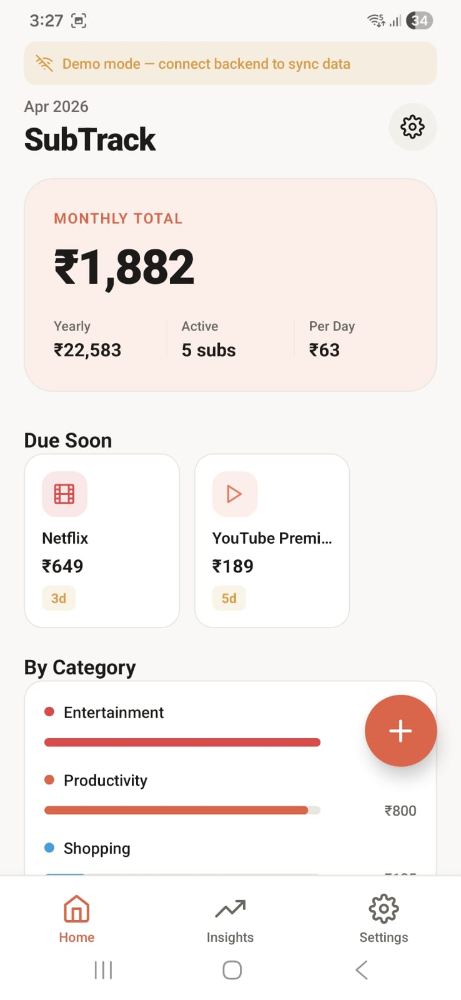
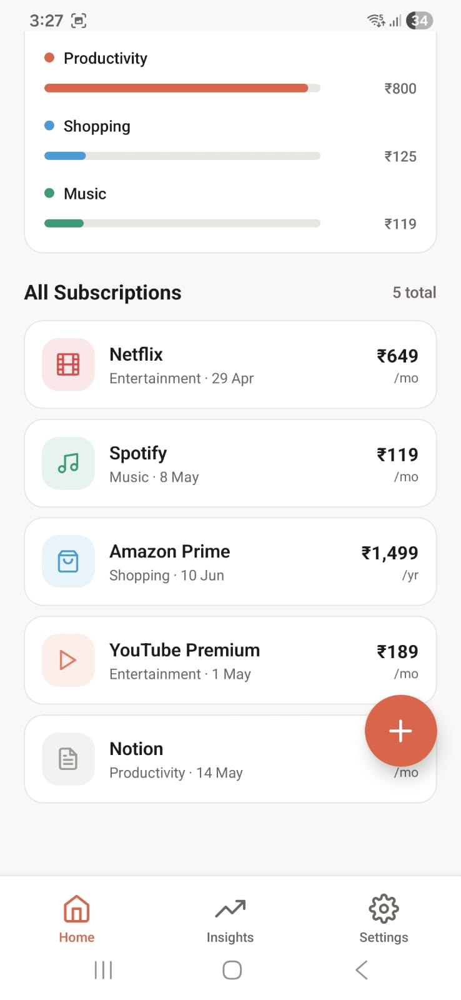
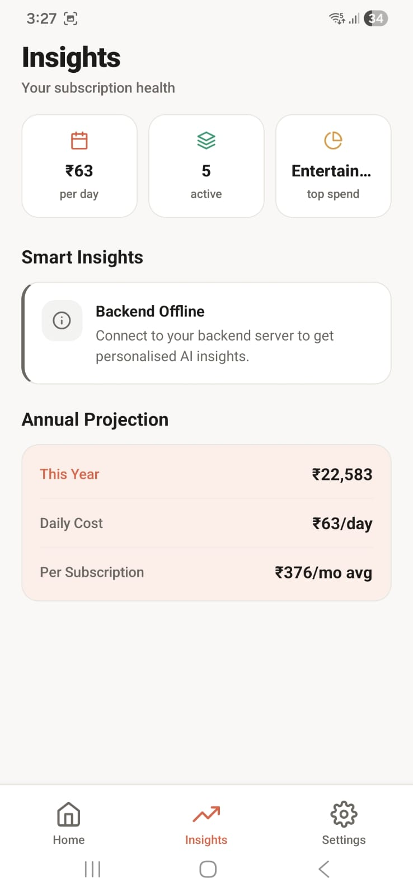
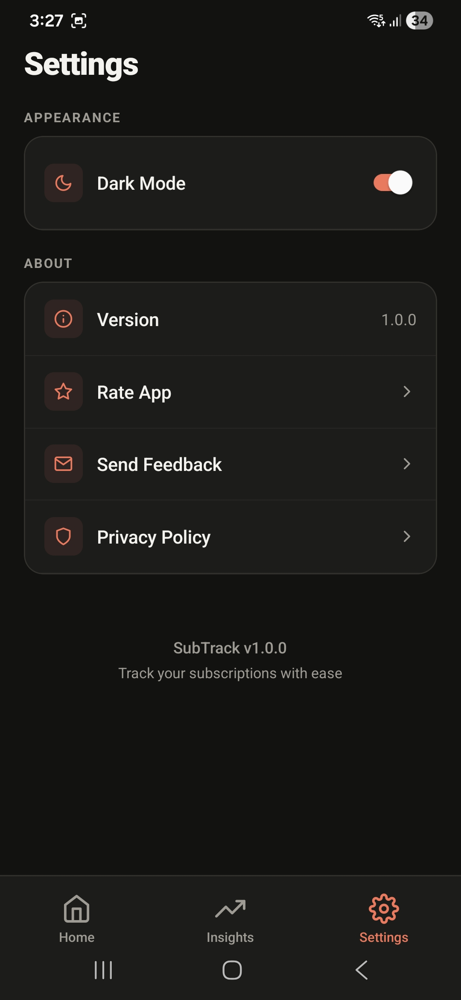

# SubTrack

SubTrack is a mobile app to track recurring subscriptions, monitor monthly and yearly spend, and identify savings opportunities.

## What This Project Does

- Tracks subscriptions with billing cycle, next billing date, category, icon, and reminder status.
- Shows analytics such as monthly total, yearly projection, category breakdown, and upcoming bills.
- Provides insights generated from your subscription data.
- Supports light and dark themes.
- Works in online mode with backend sync and in offline/demo fallback mode.

## Screenshots

  
  
  
  

## App Experience

- Home dashboard with spend summary and upcoming bills.
- Swipe-to-delete and quick actions for subscriptions.
- Detail screen for editing billing data.
- Insights screen for trends and optimization hints.
- Settings for theme and app info.

## Architecture Overview

### Frontend

- Expo + React Native + Expo Router
- Screen routes inside `app/`
- Theme state in `context/ThemeContext.tsx`
- API layer with fallback logic in `services/api.ts`

### Backend

- FastAPI service in `server.py`
- REST endpoints for subscriptions, analytics, and insights

## Main Routes

- `/(tabs)`
  - Home: subscription list and summary
  - Insights: analysis and recommendations
  - Settings: theme and app info
- `/add-subscription`
- `/subscription/[id]`

## API Surface

| Method | Endpoint | Purpose |
| --- | --- | --- |
| GET | /api/health | Service health |
| GET | /api/subscriptions | List subscriptions |
| POST | /api/subscriptions | Create subscription |
| GET | /api/subscriptions/:id | Get subscription |
| PUT | /api/subscriptions/:id | Update subscription |
| DELETE | /api/subscriptions/:id | Delete subscription |
| GET | /api/analytics | Get totals and breakdowns |
| POST | /api/insights/ai | Generate insights |
